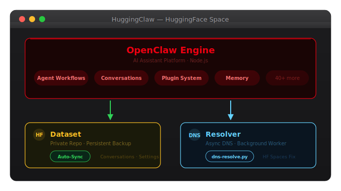

<div align="center">
  
  <br/><br/>
  <strong>The best way to deploy <a href="https://github.com/openclaw/openclaw">OpenClaw</a> on the cloud</strong>
  <br/>
  <sub>Zero hardware · Always online · Auto-persistent · One-click deploy</sub>
  <br/><br/>

  [](LICENSE)
  [](https://huggingface.co/spaces/tao-shen/HuggingClaw)
</div>

---

## Why HuggingClaw?

[OpenClaw](https://github.com/openclaw/openclaw) is a powerful, popular AI assistant (Telegram, WhatsApp, 40+ channels), but it’s meant to run on your own machine (e.g. a Mac Mini). Not everyone has that. You can deploy on the cloud, but most providers either charge by the hour or offer only very limited resources. **HuggingFace Spaces** gives you 2 vCPU and **16 GB RAM** for free — a good fit for OpenClaw, but Spaces have two problems we fix.

**HuggingClaw** is this repo. It fixes two Hugging Face Space issues: **(1) Data is not persistent** — we use a private **HuggingFace Dataset** to sync and restore your conversations, settings, and credentials so they survive restarts; **(2) DNS resolution fails** for some domains (e.g. WhatsApp) — we fix it with DNS-over-HTTPS and a Node.js DNS patch so OpenClaw can connect reliably.

## Architecture

<div align="center">
  
</div>

## Quick Start

### 1. Duplicate this Space

Click **Duplicate this Space** on the [HuggingClaw Space page](https://huggingface.co/spaces/tao-shen/HuggingClaw).

### 2. Set Secrets

Go to **Settings → Repository secrets** and configure:

| Secret | Status | Description |
|--------|:------:|-------------|
| `OPENCLAW_PASSWORD` | Recommended | Password for the Control UI (default: `huggingclaw`) |
| `HF_TOKEN` | **Required** | HF Access Token with write permission ([create one](https://huggingface.co/settings/tokens)) |
| `OPENCLAW_DATASET_REPO` | **Required** | Dataset repo for backup, e.g. `your-name/openclaw-data` |
| `OPENAI_API_KEY` | Recommended | OpenAI (or any [OpenAI-compatible](https://openclawdoc.com/docs/reference/environment-variables)) API key for LLM |
| `OPENROUTER_API_KEY` | Optional | [OpenRouter](https://openrouter.ai) API key (200+ models, free tier) |
| `ANTHROPIC_API_KEY` | Optional | Anthropic Claude API key |
| `GOOGLE_API_KEY` | Optional | Google / Gemini API key |
| `OPENCLAW_DEFAULT_MODEL` | Optional | Default model, e.g. `openai/gpt-4o-mini` or `openrouter/deepseek/deepseek-chat:free` |

> For the full list of environment variables, see [`.env.example`](.env.example).

### 3. Open the Control UI

Visit your Space URL. Click the settings icon, enter your password, and connect.

Messaging integrations (Telegram, WhatsApp) can be configured directly inside the Control UI after connecting.

## Configuration

HuggingClaw is configured entirely through **environment variables**. A fully documented template is provided in [`.env.example`](.env.example).

| Category | Variables | Purpose |
|----------|-----------|---------|
| **Security** | `OPENCLAW_PASSWORD` | Protect the Control UI with a password |
| **Persistence** | `HF_TOKEN`, `OPENCLAW_DATASET_REPO`, `AUTO_CREATE_DATASET`, `SYNC_INTERVAL` | Auto-backup to HF Dataset |
| **LLM (OpenAI-compatible)** | `OPENAI_API_KEY`, `OPENAI_BASE_URL`, `OPENROUTER_API_KEY`, `ANTHROPIC_API_KEY`, `GOOGLE_API_KEY`, `MISTRAL_API_KEY`, `COHERE_API_KEY`, `OPENCLAW_DEFAULT_MODEL` | Power AI conversations ([OpenClaw env reference](https://openclawdoc.com/docs/reference/environment-variables)) |
| **Performance** | `NODE_MEMORY_LIMIT` | Tune Node.js memory usage |
| **Locale** | `TZ` | Set timezone for logs |

For local development, copy the template and fill in your values:

```bash
cp .env.example .env
# Edit .env with your values
```

## Local Development

```bash
git clone https://huggingface.co/spaces/tao-shen/HuggingClaw
cd HuggingClaw

# Configure
cp .env.example .env
# Edit .env — at minimum set HF_TOKEN and OPENCLAW_DATASET_REPO

# Build and run
docker build -t huggingclaw .
docker run --rm -p 7860:7860 --env-file .env huggingclaw
```

Open `http://localhost:7860` in your browser.

## Security

- **Password-protected** — the Control UI requires a password to connect and manage the instance
- **Secrets stay server-side** — API keys and tokens are never exposed to the browser
- **CSP headers** — Content Security Policy restricts script and resource loading
- **Private backups** — the Dataset repo is created as private by default

> **Tip:** Change the default password from `huggingclaw` to something unique by setting the `OPENCLAW_PASSWORD` secret.

## License

MIT
